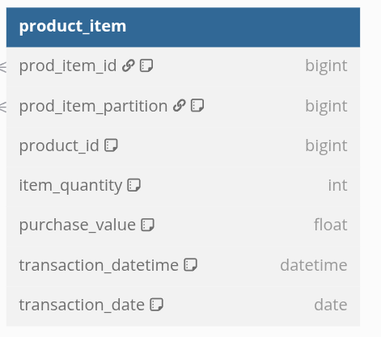

# Teste Técnico Analytics Engineer - Hotmart

## Descrição

Este desafio é composto por dois exercícios que devem ser finalizados em um prazo de até 24 horas.
Abaixo estão os desafios, dentro de cada um você encontrará a descrição e a forma que é esperado que você nos retorne.
Os exercícios tem o objetivo de avaliarem as habilidades de desenvolvimento de pipelines de dados, SQL, Python etc.

## Exercício 1
As consultas SQL estão no arquivo 'exercicio_sql_1.sql'.

a)
Optei por utilizar o filtro de purchase_status como 'APROVADA' visto que estamos atuando com dados de faturamento. Limit 50 para trazermos os 50 primeiros.

b) 
Para melhor organizacao optei por criar uma CTE calculando o faturamento de cada produto para cada produtor. Depois disso, utilizei de um artificio de em que faco um row_number para rankear os produtos e um partition by por produtor. Obtendo assim o ranking de faturamento dos produtos para cada produtor. Depois apenas realizei a consulta principal trazendo esses dados e filtrando os top 2 de cada produtor.

## Exercício 2
O script etl encontra-se no arquivo no arquivo 'exercicio_etl_2.py'.
O script foi desenvolvido utilizando pyspark. O create table do dataset final e a consulta SQL com o retorno no GMV diário encontram-se no script.
Este é um exemplo do dataset final:

Desenvolvimento: utilizei dados fictícios gerando os DataFrames utilizados para a transformação. Depois disso salvei os arquivos diários em uma pasta parquet_files para que o spark preservasse o histórico, atualizando incrementalmente e realizasse a leitura dos arquivos para gerarmos as tabelas. O idel, seria o armazenamento dos dados no formato delta, isso traria maior consistência sobretudo no processo de atualização incremental pelas suas características.
Desenvolvi um exboço de arquitetura que permitisse esse processo:

Pontos de melhoria:
- Utilização de CDC utilizando a tecnologia Delta Live Table presente no Databricks.

Obs.: 
No exercício a amostra dos dados tem os campos segundo a imagem abaixo:

Entretanto, analisando o schema percebi que a 'product_item' no arquivo do exercício possui o campo 'purchase_id' não presente no schema e não possui o campo 'prod_item_id' presente no schema. Para fins de exemplo, utilizei o purchase_id nos joins, caso não seja o correto, uma melhoria seria a correção destes joins entre 'purchase' e 'product_item'.

## Autor

Caio Souza  
[LinkedIn](https://www.linkedin.com/in/caiohas/) | [GitHub](https://github.com/caiohas)
